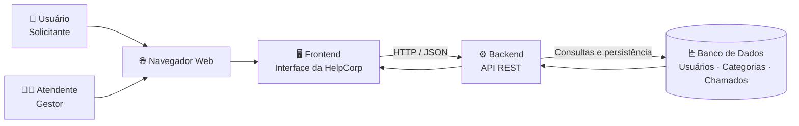
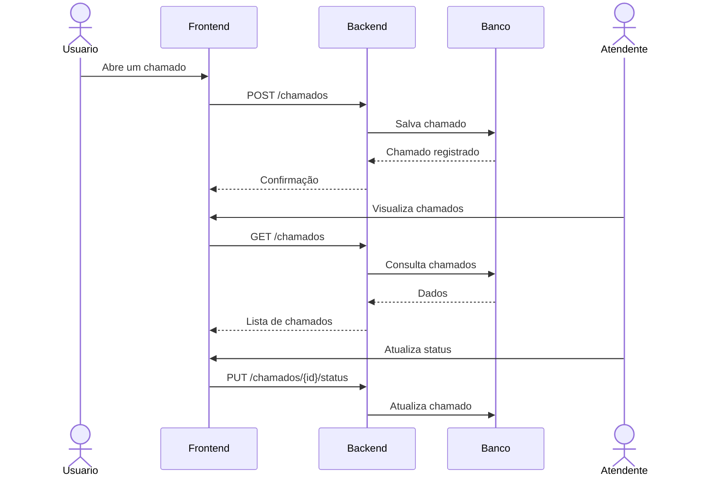

# 🎧 HelpCorp

### Plataforma de Gestão de Chamados Internos Corporativos

**Projeto Integrador — Análise de Soluções Integradas para Organizações**  
Centro Universitário SENAC · 5º semestre · 2026

 

  

**Centralizando solicitações. Simplificando o suporte. Melhorando a experiência interna.**

---

## 📌 Sobre a HelpCorp

A HelpCorp é uma plataforma de gestão de chamados internos corporativos criada para centralizar solicitações entre colaboradores e áreas como TI, RH, Financeiro, Administrativo e Facilities. A proposta é substituir canais dispersos, como e-mails e mensagens, por um fluxo único, rastreável e organizado, permitindo abrir, acompanhar, priorizar e atualizar chamados com mais transparência e eficiência.

---

## 🏗️ Arquitetura da solução

A PoC utiliza uma arquitetura web em camadas, separando interface,
processamento da aplicação e persistência dos dados.

### Fluxo principal

