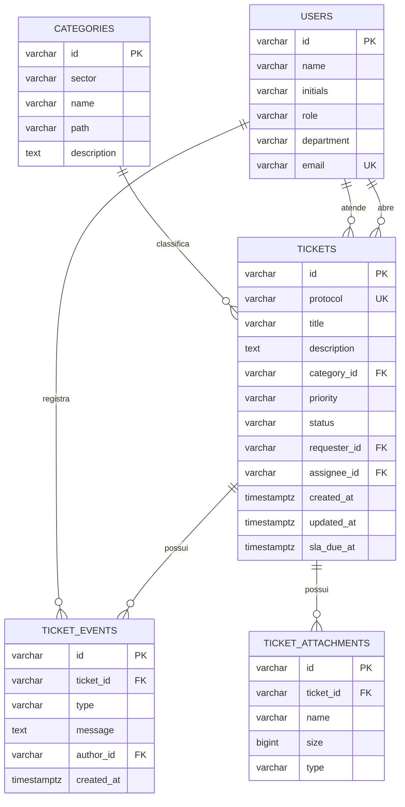

# Modelo Físico de Banco de Dados — HelpCorp

## Relacionamentos
- Um usuário solicitante pode abrir vários chamados.
- Um atendente pode ser responsável por vários chamados.
- Uma categoria pode classificar vários chamados.
- Um chamado pode possuir vários eventos e anexos.
- Um usuário pode ser autor de vários eventos.

## Domínios controlados
- `status`: `new`, `triage`, `in_progress`, `resolved`, `closed`
- `priority`: `low`, `medium`, `high`, `critical`
- `role`: `requester`, `attendant`
- `type`: `created`, `status`, `comment`, `assignment`
